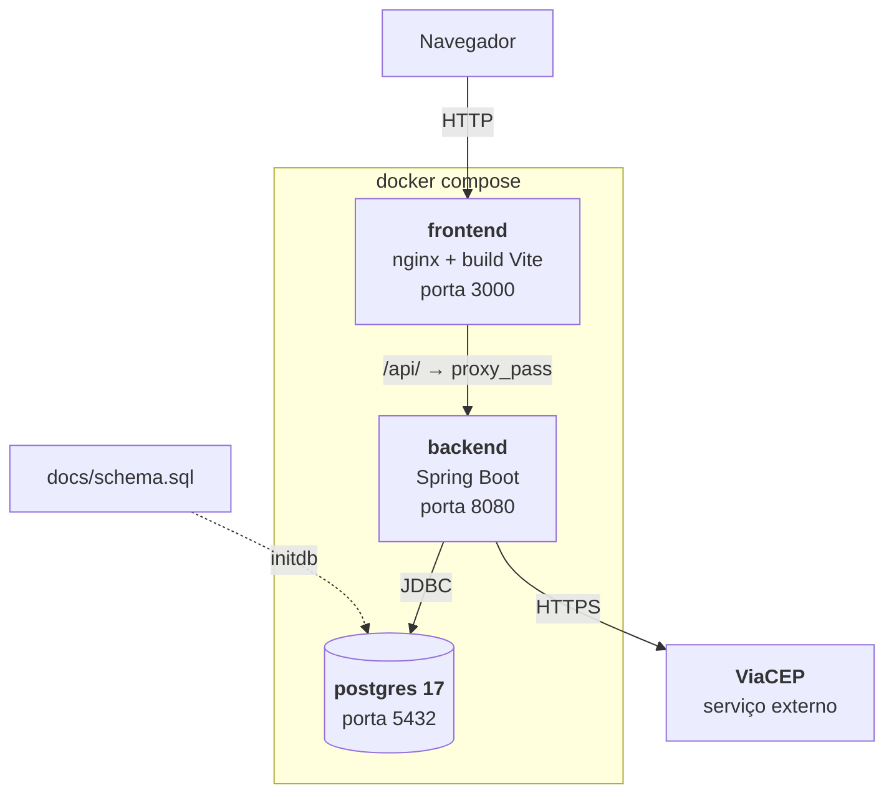
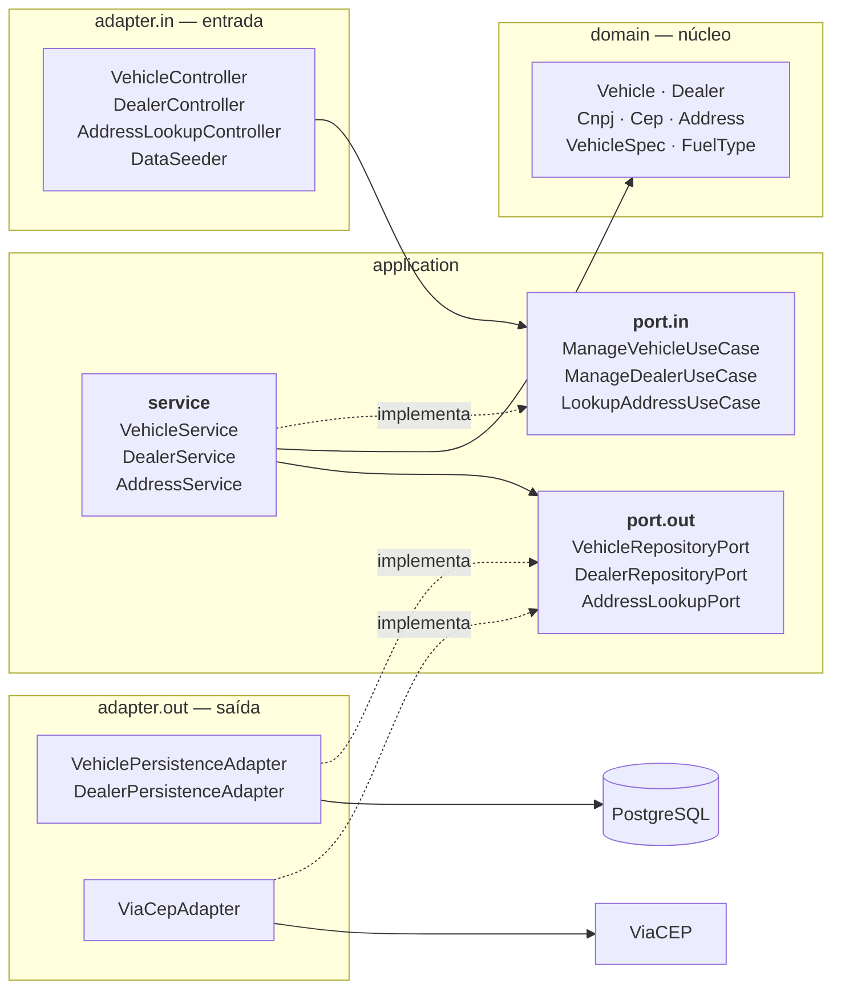

# DealerFleet — Gestão de Veículos e Concessionárias

Aplicação web para cadastro, consulta, alteração e exclusão de veículos e concessionárias, com associação entre eles. Frontend e backend separados, comunicando por API REST.

Projeto desenvolvido como desafio técnico.

## Stack

| Camada | Tecnologias |
|---|---|
| Backend | Java 21, Spring Boot 4.1, Hibernate/JPA, Maven |
| Frontend | React 19, TypeScript, Vite, TanStack Query, React Hook Form, Zod, React Router, Tailwind |
| Banco | PostgreSQL 17 (Docker) · H2 em memória (perfil de desenvolvimento) |
| Infra | Docker, Docker Compose, nginx |
| Documentação | Swagger / OpenAPI |

## Como rodar

Requisito: Docker instalado. Nada mais.

```bash
git clone https://github.com/LiedsonAugusto/DealerFleet.git
cd DealerFleet
docker compose up --build
```

Na primeira execução o build roda os testes do backend e do frontend, então demora alguns minutos. Se algum teste falhar, o build falha junto — deixei assim de propósito, para não gerar imagem com teste quebrado.

Feito isso, os endereços são:

| O quê | Endereço |
|---|---|
| Aplicação | http://localhost:3000 |
| API | http://localhost:8080 |
| Swagger | http://localhost:8080/swagger-ui.html |
| Cobertura de testes | http://localhost:3000/coverage/ |
| Banco | `localhost:5432` — base, usuário e senha `dealerfleet` |

O banco sobe com carga inicial de 5 concessionárias e 16 veículos. São dados fictícios, apenas para demonstração.

Para rodar cada parte isoladamente, sem Docker, veja os READMEs do [backend](backend/README.md) e do [frontend](frontend/README.md).

### Apontando para um PostgreSQL externo (Amazon RDS)

O Compose usa o banco em container por padrão, mas aceita um banco externo. Este projeto foi validado contra uma instância **PostgreSQL no Amazon RDS**: a aplicação sobe apontando para ela sem nenhuma alteração de código, e o `ddl-auto: validate` confirma que o schema versionado bate com o mapeamento JPA. O mesmo mecanismo serve para qualquer PostgreSQL alcançável — local ou gerenciado por outro provedor.

As variáveis do backend têm valor padrão:

```yaml
DB_URL: ${DB_URL:-jdbc:postgresql://postgres:5432/dealerfleet}
```

Basta criar um `.env` na raiz, a partir do `.env.example`, com o endereço e as credenciais do banco de destino. Como o Compose lê esse arquivo sozinho, o comando continua o mesmo:

```bash
cp .env.example .env    # preencha com o endpoint e as credenciais do banco
docker compose up -d
```

No caso do RDS, o `DB_URL` usa o endpoint da instância e exige TLS:

```properties
DB_URL=jdbc:postgresql://<instancia>.<id>.<regiao>.rds.amazonaws.com:5432/dealerfleet?sslmode=require
```

| | Sem `.env` | Com `.env` |
|---|---|---|
| `docker compose up` | banco em container | banco externo |
| `mvnw spring-boot:run` | H2 em memória | banco externo |

O mesmo arquivo serve para os dois porque o `application.yml` também o importa, de forma opcional. Sem o arquivo, nada muda: quem clonar o repositório roda tudo local com um comando só.

Duas observações. O banco externo precisa das tabelas antes, porque o perfil `docker` usa `ddl-auto: validate` e não cria schema — aplique o [`docs/schema.sql`](docs/schema.sql) uma vez no destino. E o container do PostgreSQL continua subindo mesmo quando não é usado; para evitar isso, `docker compose up -d --no-deps backend frontend`.

O `.env` está no `.gitignore`. Nenhuma credencial real é versionada.

## Arquitetura

### Visão de contêineres



O nginx serve o site e repassa tudo que começa com `/api/` para o backend. Como o navegador só conversa com o nginx, as duas coisas ficam no mesmo endereço e não existe CORS no fluxo do Docker.

As tabelas do banco são criadas pelo [`docs/schema.sql`](docs/schema.sql) quando o container do PostgreSQL sobe pela primeira vez. O backend usa `ddl-auto: validate`, então ele não cria nem altera tabela: se o mapeamento JPA não bater com o script, a aplicação não inicia.

### Arquitetura hexagonal do backend



Seta cheia significa "depende de", seta tracejada significa "implementa". Nenhuma seta cheia sai do centro: o pacote `domain` não usa Spring, JPA nem HTTP. É Java puro, e por isso dá para testar sem subir a aplicação.

As duas tracejadas que saem dos adapters são o ponto principal do desenho. O `VehicleService` chama o banco em tempo de execução, mas quem depende de quem no código é o contrário: o adapter é que implementa a interface que está na camada de dentro. Isso é inversão de dependência, e é o que permite trocar o banco sem mexer em regra de negócio.

Dois pontos importantes:

- **O `DataSeeder` usa a mesma porta que os controllers.** Ele não acessa repositório: chama `ManageDealerUseCase`. Então a carga inicial passa pelas mesmas validações de um cadastro feito pela tela.
- **Nos testes de serviço, as portas de saída são substituídas por mocks.** É o que permite testar `application.service` sem acessar o banco.

## API

Base: `http://localhost:8080`. Contrato completo no [Swagger](http://localhost:8080/swagger-ui.html).

### Veículos

| Método | Rota | Descrição |
|---|---|---|
| `GET` | `/vehicles` | Lista todos |
| `GET` | `/vehicles/{id}` | Consulta por identificador |
| `POST` | `/vehicles` | Cadastra |
| `PUT` | `/vehicles/{id}` | Atualiza |
| `DELETE` | `/vehicles/{id}` | Exclui |
| `PUT` | `/vehicles/{id}/dealer` | Vincula ou troca a concessionária |
| `DELETE` | `/vehicles/{id}/dealer` | Desvincula |

### Concessionárias

| Método | Rota | Descrição |
|---|---|---|
| `GET` | `/dealer` | Lista todas |
| `GET` | `/dealer/{id}` | Consulta por identificador |
| `POST` | `/dealer` | Cadastra |
| `PUT` | `/dealer/{id}` | Atualiza |
| `DELETE` | `/dealer/{id}` | Exclui, se não houver veículo vinculado |
| `GET` | `/dealer/{id}/vehicles` | Lista os veículos da concessionária |

### Endereço

| Método | Rota | Descrição |
|---|---|---|
| `GET` | `/cep/{cep}` | Consulta endereço no ViaCEP |

Os erros seguem o padrão [RFC 7807](https://datatracker.ietf.org/doc/html/rfc7807) (`application/problem+json`). Quando é erro de validação, a resposta traz um objeto `errors` com a mensagem de cada campo, e o frontend usa isso para marcar o campo certo no formulário.

Toda requisição tem um `X-Request-Id`. O frontend envia um; se não vier, o backend gera. Ele vai para o log e volta no cabeçalho da resposta, o que permite achar nos logs exatamente a requisição que deu problema.

## Testes

```bash
cd backend  && ./mvnw test        # 182 testes
cd frontend && yarn test:coverage # 159 testes
```

Os relatórios ficam publicados na própria aplicação, em http://localhost:3000/coverage/.

| | Testes | Cobertura |
|---|---|---|
| Backend | 182 | 99,7% instruções · 99% branches |
| Frontend | 159 | 87,5% statements · 89,8% branches |

A cobertura é maior onde tem regra de negócio: domínio, serviços e schemas de validação estão em 100%. O que fica abaixo disso é componente de tela, que praticamente não tem lógica.

## Requisitos do desafio

### Obrigatórios

| Requisito | Situação |
|---|---|
| CRUD de veículos | Completo |
| CRUD de concessionárias | Completo |
| Associação de veículos a concessionárias | Completo — vincular, trocar e listar por concessionária |
| Endpoints REST especificados | Completo, incluindo `/dealer` no singular |
| Java 21 · Spring Boot · JPA · Maven | Completo |
| React · TypeScript · Vite | Completo |
| TanStack Query · React Hook Form · Zod · React Router | Completo |
| Validação de campos obrigatórios | Completo, no cliente e no servidor |
| Validação de CNPJ | Completo, com dígito verificador nas duas pontas |
| Validação de CEP | Completo |
| Enum de combustível | `GASOLINA` `ETANOL` `FLEX` `DIESEL` `ELETRICO` `HIBRIDO` |
| Banco relacional | PostgreSQL 17 |
| UX: loading, erros, validação no cliente, navegação | Completo |

### Diferenciais

| Diferencial | Situação |
|---|---|
| Integração ViaCEP | Feito — preenchimento automático a partir do CEP |
| Docker: banco, aplicação e Compose | Feito |
| Testes unitários | Feito — 341 testes |
| Observabilidade: logs estruturados | Feito — formato ECS no perfil `docker`, com correlação por requisição |
| Documentação da API: Swagger/OpenAPI | Feito |
| Responsividade | Feito |
| **Deploy em AWS** | **Parcial** — banco em Amazon RDS; aplicação não publicada |

## Estrutura do repositório

```
.
├── backend/          API REST em Spring Boot        → backend/README.md
├── frontend/         SPA em React                   → frontend/README.md
├── docs/
│   └── schema.sql    DDL do PostgreSQL
├── .env.example      Variáveis para apontar a um banco externo
└── docker-compose.yml
```
