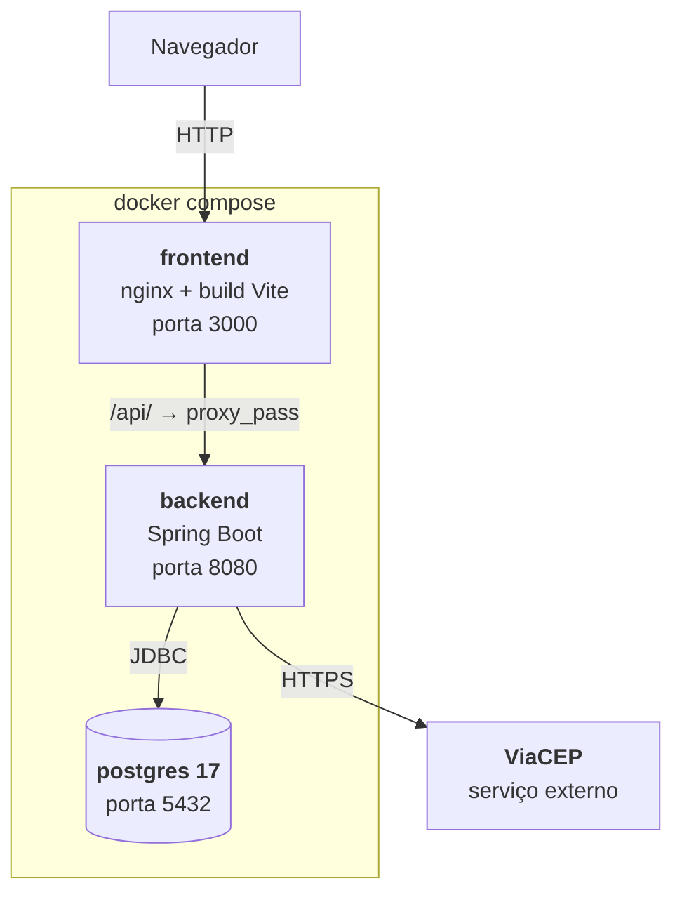
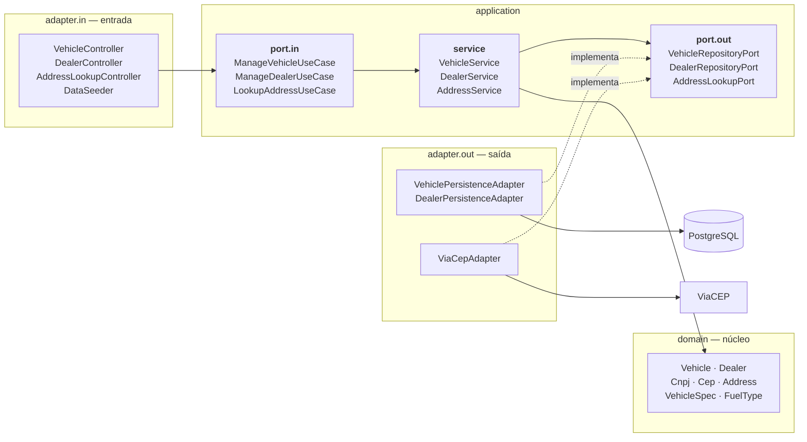

# DealerFleet — Gestão de Veículos e Concessionárias

Aplicação web para cadastro, consulta, alteração e exclusão de veículos e concessionárias, com associação entre eles. Frontend e backend separados, comunicando por API REST.

Desafio técnico.

## Stack

| Camada | Tecnologias |
|---|---|
| Backend | Java 21, Spring Boot 4.1, Hibernate/JPA, Maven |
| Frontend | React 19, TypeScript, Vite, TanStack Query, React Hook Form, Zod, React Router, Tailwind |
| Banco | PostgreSQL 17 (Docker) · H2 em memória (perfil de desenvolvimento) |
| Infra | Docker, Docker Compose, nginx |
| Documentação | Swagger / OpenAPI |

## Como rodar

Requisito: Docker instalado. Nada mais.

```bash
git clone https://github.com/LiedsonAugusto/DealerFleet.git
cd DealerFleet
docker compose up --build
```

Na primeira execução o build roda as duas suítes de teste, então demora alguns minutos. **Se algum teste falhar, o build falha** — é proposital.

Pronto isso, os endereços são:

| O quê | Endereço |
|---|---|
| Aplicação | http://localhost:3000 |
| API | http://localhost:8080 |
| Swagger | http://localhost:8080/swagger-ui.html |
| Cobertura de testes | http://localhost:3000/coverage/ |
| Banco | `localhost:5432` — base, usuário e senha `dealerfleet` |

O banco sobe com carga inicial de 5 concessionárias e 16 veículos. São dados fictícios, apenas para demonstração.

Para rodar cada parte isoladamente, sem Docker, veja os READMEs do [backend](backend/README.md) e do [frontend](frontend/README.md).

## Arquitetura

### Visão de contêineres



O nginx serve o SPA e repassa `/api/` para o backend. Como o navegador conversa só com o nginx, tudo acontece na mesma origem e não há CORS envolvido no fluxo do Docker.

O schema do banco é criado a partir de [`docs/schema.sql`](docs/schema.sql) na inicialização do container. O backend sobe com `ddl-auto: validate`, ou seja, ele recusa iniciar se o mapeamento JPA divergir desse arquivo.

### Arquitetura hexagonal do backend



As dependências apontam para dentro. O pacote `domain` não importa Spring, JPA nem HTTP — é Java puro, e por isso é testável sem subir contexto nenhum.

Dois detalhes que valem reparar:

- **O `DataSeeder` entra pela mesma porta que os controllers.** Ele não fala com repositório: chama `ManageDealerUseCase`. A carga inicial passa pelas mesmas validações de qualquer cadastro feito pela tela.
- **As portas de saída são o que os testes de serviço substituem por dublê.** É por isso que `application.service` está em 100% de cobertura sem encostar em banco.

## API

Base: `http://localhost:8080`. Contrato completo no [Swagger](http://localhost:8080/swagger-ui.html).

### Veículos

| Método | Rota | Descrição |
|---|---|---|
| `GET` | `/vehicles` | Lista todos |
| `GET` | `/vehicles/{id}` | Consulta por identificador |
| `POST` | `/vehicles` | Cadastra |
| `PUT` | `/vehicles/{id}` | Atualiza |
| `DELETE` | `/vehicles/{id}` | Exclui |
| `PUT` | `/vehicles/{id}/dealer` | Vincula ou troca a concessionária |
| `DELETE` | `/vehicles/{id}/dealer` | Desvincula |

### Concessionárias

| Método | Rota | Descrição |
|---|---|---|
| `GET` | `/dealer` | Lista todas |
| `GET` | `/dealer/{id}` | Consulta por identificador |
| `POST` | `/dealer` | Cadastra |
| `PUT` | `/dealer/{id}` | Atualiza |
| `DELETE` | `/dealer/{id}` | Exclui, se não houver veículo vinculado |
| `GET` | `/dealer/{id}/vehicles` | Lista os veículos da concessionária |

### Endereço

| Método | Rota | Descrição |
|---|---|---|
| `GET` | `/cep/{cep}` | Consulta endereço no ViaCEP |

Erros seguem [RFC 7807](https://datatracker.ietf.org/doc/html/rfc7807) (`application/problem+json`). Erros de validação trazem um objeto `errors` com a mensagem por campo, que o frontend usa para marcar o campo correspondente no formulário.

Toda requisição carrega um `X-Request-Id`, gerado pelo frontend ou pelo backend, propagado ao log e devolvido na resposta.

## Testes

```bash
cd backend  && ./mvnw test        # 181 testes
cd frontend && yarn test:coverage # 159 testes
```

Os relatórios ficam publicados na própria aplicação, em http://localhost:3000/coverage/.

| | Testes | Cobertura |
|---|---|---|
| Backend | 181 | 99,7% instruções · 99% branches |
| Frontend | 159 | 87,5% statements · 89,8% branches |

A cobertura acompanha o risco: domínio, serviços e schemas de validação estão em 100%; o que fica abaixo é componente de apresentação, sem ramificação nem regra de negócio.

## Requisitos do desafio

### Obrigatórios

| Requisito | Situação |
|---|---|
| CRUD de veículos | Completo |
| CRUD de concessionárias | Completo |
| Associação de veículos a concessionárias | Completo — vincular, trocar e listar por concessionária |
| Endpoints REST especificados | Completo, incluindo `/dealer` no singular |
| Java 21 · Spring Boot · JPA · Maven | Completo |
| React · TypeScript · Vite | Completo |
| TanStack Query · React Hook Form · Zod · React Router | Completo |
| Validação de campos obrigatórios | Completo, no cliente e no servidor |
| Validação de CNPJ | Completo, com dígito verificador nas duas pontas |
| Validação de CEP | Completo |
| Enum de combustível | `GASOLINA` `ETANOL` `FLEX` `DIESEL` `ELETRICO` `HIBRIDO` |
| Banco relacional | PostgreSQL 17 |
| UX: loading, erros, validação no cliente, navegação | Completo |

### Diferenciais

| Diferencial | Situação |
|---|---|
| Integração ViaCEP | Feito — preenchimento automático a partir do CEP |
| Docker: banco, aplicação e Compose | Feito |
| Testes unitários | Feito — 340 testes |
| Observabilidade: logs estruturados | Feito — formato ECS no perfil `docker`, com correlação por requisição |
| Documentação da API: Swagger/OpenAPI | Feito |
| Responsividade | Feito |
| **Deploy em AWS** | **Não feito** — escopo reduzido por prazo |

## Estrutura do repositório

```
.
├── backend/          API REST em Spring Boot        → backend/README.md
├── frontend/         SPA em React                   → frontend/README.md
├── docs/
│   └── schema.sql    DDL do PostgreSQL
└── docker-compose.yml
```
